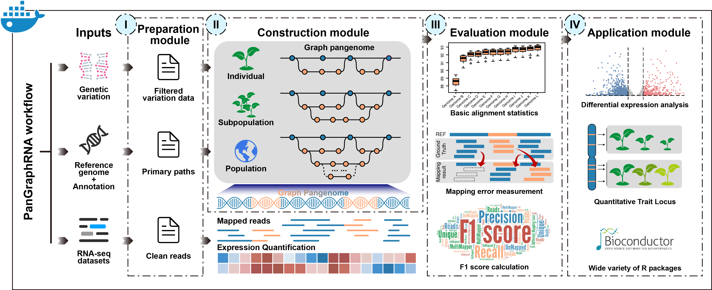

## PanGraphRNA: an efficient and flexible bioinformatics platform for graph pangenome-based RNA-seq data analysis

<a href="https://hub.docker.com/r/malab/pangraphrna" target="_blank"></a><a href="https://hub.docker.com/r/malab/pangraphrna" target="_blank"></a><a href="https://github.com/cma2015/PanGraphRNA" target="_blank"></a>

## Introduction
- PanGraphRNA is an efficient, flexible and web-based Galaxy platform that can be easily used to construct graph pangenomes from genetic variations at individual, subpopulation, and population levels. It can assist researchers to select appropriate graph pangenomes using various performance metrics for both real and simulation experiments. Currently, PanGraphRNA is composed of four graph pangenome-related functional modules: **Preparation Module, Construction Module, Evaluation Module, and Application Module**. 
- The PanGraphRNA project is hosted on https://github.com/cma2015/PanGraphRNA.
- The PanGraphRNA Docker image can be obtained from https://hub.docker.com/r/malab/pangraphrna.

## How to use PanGraphRNA
- Test data and tutorial of PanGraphRNA are presented at https://github.com/cma2015/PanGraphRNA/tree/main/Tutorials
- [The installation of PanGraphRNA](https://github.com/cma2015/PanGraphRNA/blob/main/Tutorials/00_Installation.md)
- [The Graph Pangenome Preparation Module](https://github.com/cma2015/PanGraphRNA/blob/main/Tutorials/01_Graph_Pangenome_Preparation_Module.md)
- [The Graph Pangenome Construction Module](https://github.com/cma2015/PanGraphRNA/blob/main/Tutorials/02_Graph_Pangenome_Construction_Module_and_Alignment.md)
- [The Graph Pangenome Evaluation Module](https://github.com/cma2015/PanGraphRNA/blob/main/Tutorials/03_Graph_Pangenome_Evaluation_Module.md)
- [The Graph Pangenome Application Module](https://github.com/cma2015/PanGraphRNA/blob/main/Tutorials/04_Graph_Pangenome_Application_Module.md)

## How to cite PanGraphRNA
- Bu, Y., Qiu, Z., Sun, W., Han, Y., Liu, Y., Yang, J., Song, M., Li, Z., Zhang, Y., & Ma, C. (2024). PanGraphRNA: an efficient and flexible bioinformatics platform for graph pangenome-based RNA-seq data analysis. (Submitted)

## How to access help
* Comments/suggestions/bugs/issues are welcome reported [here](https://github.com/cma2015/PanGraphRNA/issues) or contact: Yifan Bu b761307648@163.com, Minggui Song smg@nwafu.edu.cn or Chuang Ma chuangma2006@gmail.com

## Change log
- 2024.10 Release PanGraphRNA v1.0
- 2022.09 we launched PanGraphRNA project

## Quick start

- **Step 1**: Docker installation

  **i) Docker installation and start ([Official installation tutorial](https://docs.docker.com/install))**

  For **Windows (Only available for Windows 10 Prefessional and Enterprise version):**

  - Download [Docker](https://download.docker.com/win/stable/Docker for Windows Installer.exe) for windows;
  - Double click the EXE file to open it;
  - Follow the wizard instruction and complete installation;
  - Search docker, select **Docker for Windows** in the search results and click it.

  For **Mac OS X (Test on macOS Sierra version 10.12.6 and macOS High Sierra version 10.13.3):**

  - Download [Docker](https://download.docker.com/mac/stable/Docker.dmg) for Mac OS;

  - Double click the DMG file to open it;
  - Drag the docker into Applications and complete installation;
  - Start docker from Launchpad by click it.

  For **Ubuntu (Test on Ubuntu 18.04 LTS):**

  - Go to [Docker](https://download.docker.com/linux/ubuntu/dists/), choose your Ubuntu version, browse to **pool/stable** and choose **amd64, armhf, ppc64el or s390x**. Download the **DEB** file for the Docker version you want to install;

  - Install Docker, supposing that the DEB file is download into following path:**"/home/docker-ce~ubuntu_amd64.deb"**

    ```
      $ sudo dpkg -i /home/docker-ce<version-XXX>~ubuntu_amd64.deb      
      $ sudo apt-get install -f
    ```

  **ii) Verify if Docker is installed correctly**
  
  Once Docker installation is completed, we can run `hello-world` image to verify if Docker is installed correctly. Open terminal in Mac OS X and Linux operating system and open CMD for Windows operating system, then type the following command:

```
 $ docker run hello-world
```

**Note:** root permission is required for Linux operating system.

- **Step 2**: PanGraphRNA installation from Docker Hub

```
# pull latest PanGraphRNA Docker image from docker hub
$ docker pull malab/pangraphrna
```

- **Step 3**: Launch PanGraphRNA local server

```
$ docker run -it -p 880:8080 malab/pangraphrna bash
$ bash /home/galaxy/run.sh
```

Then, PanGraphRNA local server can be accessed via [http://localhost:8080](http://localhost:8080/)


- **Step 4**: Upload RNA-seq, reference genome and variation data
Specify the data format and upload a single-genome FASTA file reference genome to delineate primary paths, a GTF (general transfer format) file containing the gene annotations, a VCF (variant call format) file detailing genetic variations, a collection of RNA-seq FASTQ files and any of other file required in functions.
Here, we have provided small test files in the `testdata.tar.gz` to help users quickly get started with PanGraphRNA.

- **Step 5**: Construct graph pangenome and perform read-genome alignment
Then we can construct graph pangenomes at the individual, subpopulation, or population level. Subsequently, this module performs read-genome alignment.
- Individual Level Graph Pangenome
**Input reference genome file:** Input reference genome file for primary path of graph pangenome in FASTA format (e.g. `Col0_test.fasta`)
**Input VCF file:** Input VCF file containing variant information to be integrated into the primary path of graph pangenome in VCF format (e.g. `10015.vcf`, accession name `10015`)
**Input FASTQ file:** Cleaned single-end or paired-end RNA-seq reads in FASTQ format (e.g. `test.fastq`)


- Subpopulation Level Graph Pangenome
**Input reference genome file:** Input reference genome file for primary path of graph pangenome in FASTA format
**Input VCF file:** Input VCF file containing variant information to be integrated into the primary path of graph pangenome in VCF format
**Input accession name list:** Input accession name list (TXT file) available in the VCF file to specify the variant data
**Input FASTQ file:** Cleaned single-end or paired-end RNA-seq reads in FASTQ format


- Population Level Graph 
**Input reference genome file:** Input reference genome file for primary path of graph pangenome in FASTA format
**Input VCF file:** Input VCF file containing variant information to be integrated into the primary path of graph pangenome in VCF format
**Input FASTQ file:** Cleaned single-end or paired-end RNA-seq reads in FASTQ format


- **Step 6**: Assesse the performance of graph pangenomes against the SLR strategy
Obtain the bascic alignment information among multiple read-genome alignment results (Alignment information matrix in TXT format).


Perform RNA-seq reads simulation and measure mapping errors (Measurement of mapping errors in CSV format).


Perform RNA-seq reads simulation and calculate F1 score (Calculation of F1 score in CSV format).

